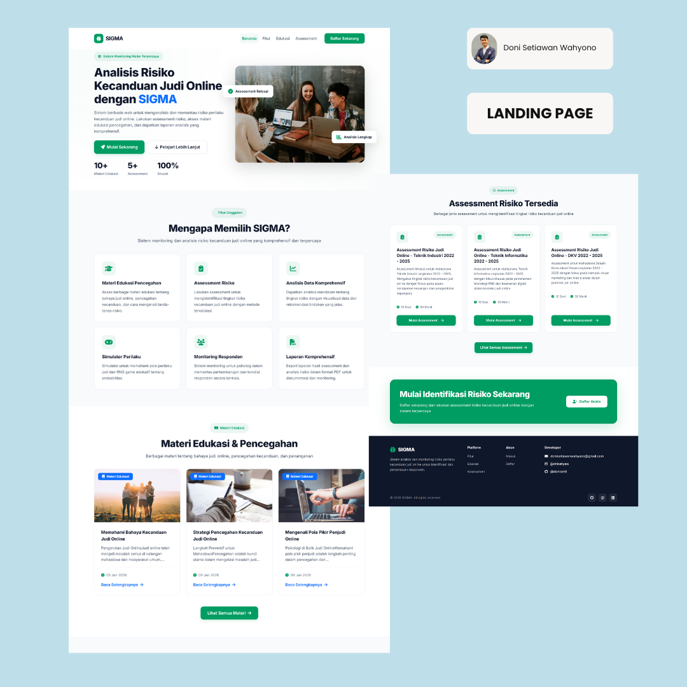
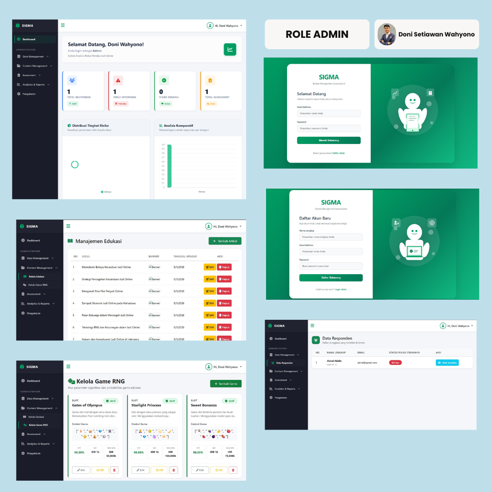
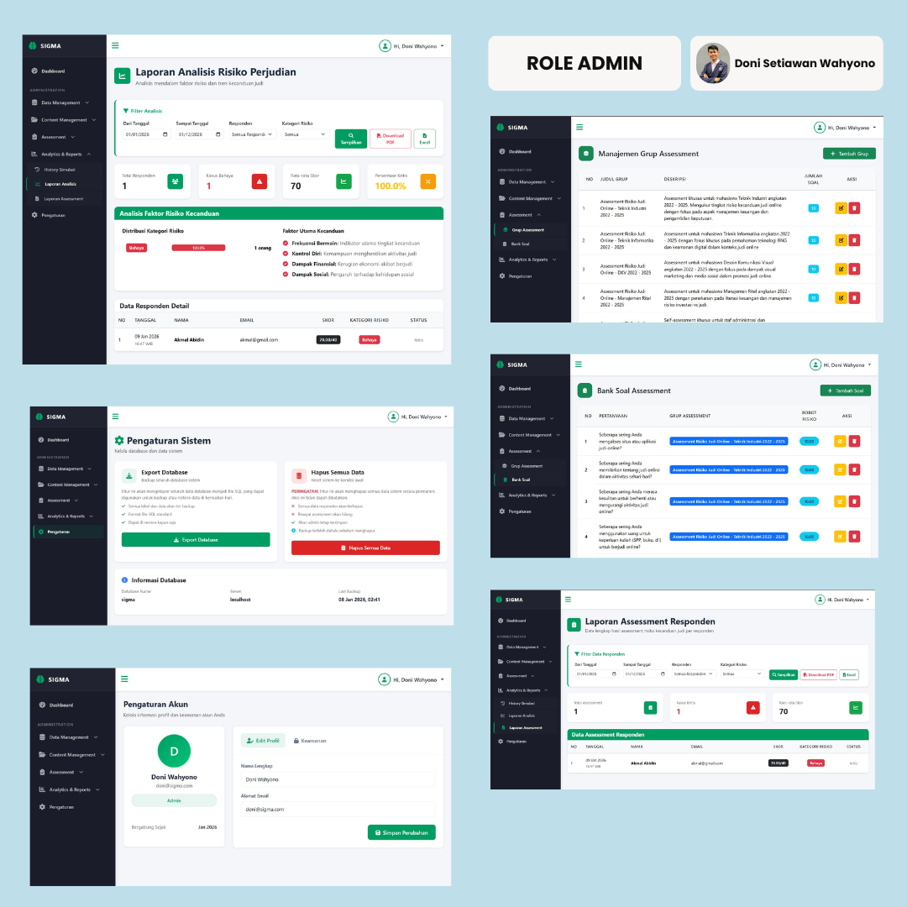
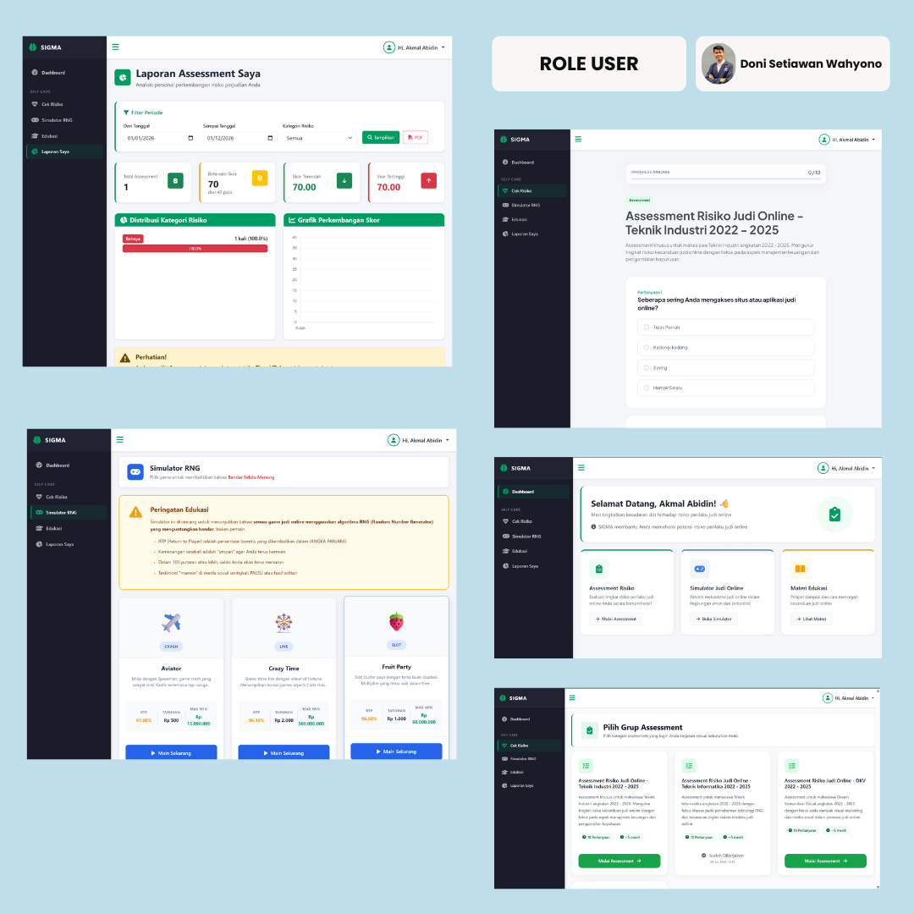
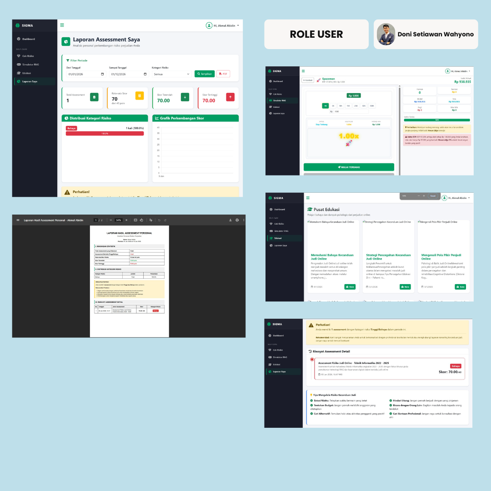

# SIGMA - Sistem Analisis Risiko Perilaku Judi Online

## Informasi Mahasiswa

- **Nama:** Doni Setiawan Wahyono
- **NIM:** 23552011146
- **Program Studi:** Teknik Informatika
- **Mata Kuliah:** Pemrograman Web 1 (UAS)

## Deskripsi Project

SIGMA adalah sistem berbasis web untuk menganalisis dan memantau risiko perilaku kecanduan judi online. Sistem ini menyediakan assessment risiko, analisis data, dan laporan komprehensif untuk membantu identifikasi dan monitoring responden.

**Sistem ini menggunakan arsitektur API RESTful** untuk komunikasi antara frontend dan backend, memungkinkan operasi CRUD yang lebih terstruktur dan dapat diintegrasikan dengan aplikasi lain di masa mendatang.

## Screenshot Aplikasi

### Landing Page & Admin Interface

<table>
  <tr>
    <td></td>
    <td></td>
    <td></td>
  </tr>
</table>

### Admin & User Interface

<table>
  <tr>
    <td></td>
    <td></td>
    <td></td>
  </tr>
</table>

## Fitur Utama

### 1. Manajemen User

- Registrasi dan autentikasi user
- Role-based access (Admin dan User)
- Profil user dengan update data dan change password

### 2. Assessment Risiko

- Kuesioner assessment dengan 10 pertanyaan
- Sistem skoring otomatis (0-40 poin)
- Kategorisasi risiko: Rendah, Sedang, Tinggi, Bahaya
- History assessment per user
- Grup assessment untuk organisasi data

### 3. Modul Edukasi

- Manajemen konten edukasi (CRUD via API)
- Upload gambar dan video
- Akses edukasi untuk user
- Interface dinamis dengan JavaScript

### 4. Simulator Judi

- Simulasi Random Number Generator (RNG)
- Tracking history simulasi
- Statistik win/loss rate

### 5. Laporan & Analisis

- **Laporan Analisis Risiko:** Ringkasan eksekutif, distribusi kategori, tren risiko
- **Laporan Assessment Responden:** Data detail per responden
- Filter berdasarkan tanggal, kategori risiko, dan user
- Export ke PDF menggunakan DomPDF
- Export ke Excel menggunakan SheetJS

### 6. Dashboard

- Statistik real-time
- Grafik distribusi risiko
- Total assessment dan user

### 7. Pengaturan Sistem (Admin Only)

- Export database ke file SQL (backup)
- Hapus semua data sistem
- Informasi last backup dengan timezone Indonesia

## Teknologi yang Digunakan

### Backend

- PHP 7.4+ (Native, MVC Pattern)
- **RESTful API Architecture** untuk operasi data
- MySQL/MariaDB
- PDO untuk database connection
- Composer untuk dependency management
- DomPDF untuk PDF generation

### Frontend

- HTML5, CSS3, JavaScript (ES6+)
- Bootstrap 5.3.0
- Font Awesome 6.4.0
- Chart.js untuk visualisasi data
- SheetJS (xlsx) untuk export Excel
- **Fetch API** untuk komunikasi dengan backend API

### Environment

- XAMPP (Apache, MySQL, PHP)
- Composer

## Arsitektur API

Project ini menggunakan **RESTful API** untuk memisahkan logika frontend dan backend:

- **API Controllers** (`app/api/controllers/`): Menangani request API dan mengembalikan JSON response
- **Web Controllers** (`app/controllers/`): Menangani rendering view HTML
- **API Endpoints**: Semua endpoint API dimulai dengan `/api/*`

**Dokumentasi API Lengkap:** Lihat file [API_DOCUMENTATION.md](API_DOCUMENTATION.md)

### API Modules:

- **Authentication API**: Login, Register
- **Education API**: CRUD konten edukasi
- **Assessment Groups API**: Manajemen grup assessment
- **Questions API**: Manajemen bank soal
- **Respondent API**: Data responden dan history
- **Profile API**: Update profil dan password

## Instalasi

### Prerequisite

- XAMPP atau web server dengan PHP 7.4+
- MySQL/MariaDB
- Composer

### Langkah Instalasi

1. Clone atau copy project ke folder htdocs

```bash
cd C:\xampp\htdocs
```

2. Import database

- Buat database baru dengan nama `sigma`
- Import file SQL (jika ada) atau buat tabel sesuai struktur

3. Konfigurasi database
   Edit file `config/Database.php`:

```php
private $host = "localhost";
private $db_name = "sigma";
private $username = "root";
private $password = "";
```

4. Install dependencies

```bash
composer install
```

5. Jalankan aplikasi

- Start Apache dan MySQL di XAMPP
- Akses via browser: `http://localhost/sigma`

## API Documentation

Project ini menggunakan **RESTful API** untuk operasi CRUD data. Semua endpoint API dimulai dengan `/api/*` dan mengembalikan response dalam format JSON.

**📖 Dokumentasi API Lengkap:** Lihat file [API_DOCUMENTATION.md](API_DOCUMENTATION.md)

### Contoh API Usage:

```javascript
// Fetch education list
fetch("http://localhost/sigma/index.php?url=api/education")
  .then((response) => response.json())
  .then((data) => {
    if (data.success) {
      console.log(data.data);
    }
  });
```

### Available API Endpoints:

- `/api/auth/login` - Login user
- `/api/auth/register` - Register user
- `/api/education` - CRUD konten edukasi
- `/api/assessment-groups` - CRUD grup assessment
- `/api/questions` - CRUD bank soal
- `/api/respondent` - Data responden
- `/api/profile` - Update profil & password

Untuk detail lengkap request/response format, query parameters, dan contoh response, lihat [API_DOCUMENTATION.md](API_DOCUMENTATION.md)

## Default Login

**Admin:**

- Username/Email: doni@sigma.com
- Password: password

**User:**

- Registrasi melalui halaman register

## Kategori Risiko

- **Rendah (0-10 poin):** Kondisi normal, awareness
- **Sedang (11-20 poin):** Monitoring rutin dan edukasi preventif
- **Tinggi (21-30 poin):** Perlu monitoring intensif
- **Bahaya (31-40 poin):** Memerlukan konseling psikologis segera

## Fitur Keamanan

- Password hashing menggunakan `password_hash()`
- Session-based authentication
- Middleware untuk role-based access control
- Prepared statements untuk mencegah SQL injection
- Input validation dan sanitization

## Browser Support

- Chrome (Recommended)
- Firefox
- Edge
- Safari

## Lisensi

Project ini dibuat untuk keperluan akademik (UAS Pemrograman Web 1).

---

Dikembangkan oleh Doni Setiawan Wahyono - 2026
